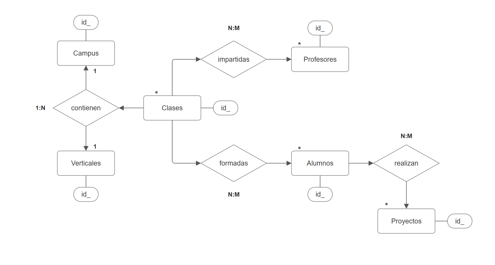
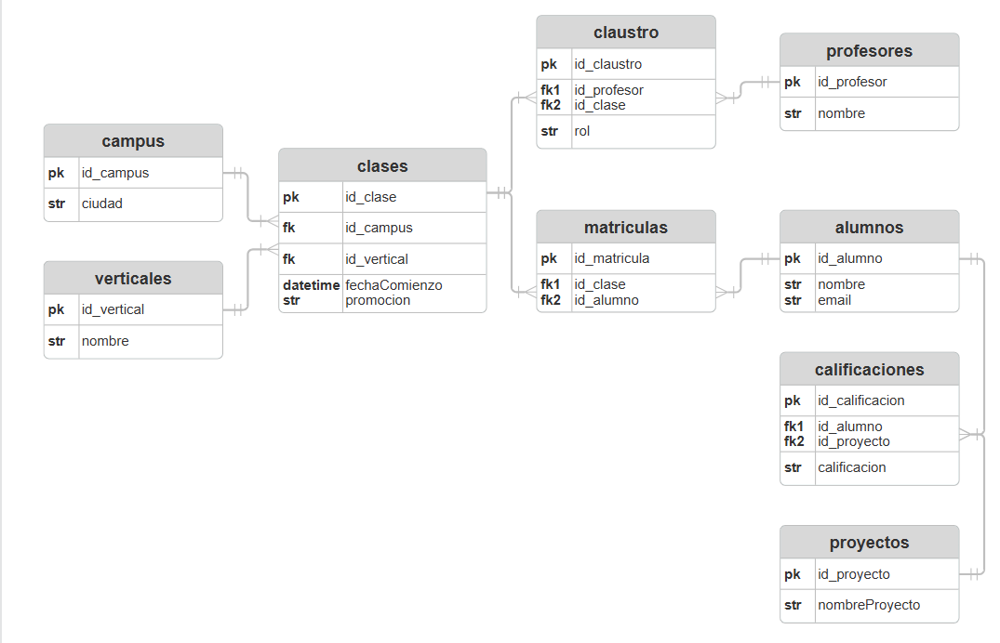

# Proyecto de Creación de Base de Datos Relacional - Bootcamp The Bridge

## 🧠 Descripción

Este proyecto consiste en el diseño, normalización e implementación de una base de datos relacional para gestionar la información de una escuela de bootcamps. La base de datos ha sido creada a partir de datos de entrada no normalizados, aplicando buenas prácticas de modelado de datos, integridad referencial y escalabilidad.

El objetivo principal ha sido convertir una tabla plana con múltiples campos en un sistema relacional coherente que permita consultas eficientes y organización estructurada.

## 👥 Integrantes del equipo

- Cristian Vásquez
- Daniel Gonzalez
- Ignacio Talvi
- Michelle Alejandra Diaz

## 🗂️ Contenidos del proyecto

1. **Modelo Entidad-Relación (E/R)**  
   Diseño visual de las entidades, atributos y relaciones.  
   

2. **Modelo Lógico**  
   Transformación del modelo E/R a un modelo lógico con claves primarias, foráneas y relaciones normalizadas.  
   

3. **Normalización de Datos**  
   Aplicación de las formas normales necesarias para garantizar la integridad y eliminar redundancia.

4. **Creación e Ingesta de la Base de Datos**  
   Scripts SQL para:
   - Creación de la base de datos y tablas
   - Ingesta de los datos
   - Consultas de demostración

5. **Escalabilidad**  
   La base de datos está diseñada para permitir la incorporación de:
   - Nuevos campus (ej. Madrid, Valencia...)
   - Nuevas verticales (Data Science, Full Stack...)
   - Modalidades (Online, Presencial...)
   - Promociones (Febrero, Septiembre...)

## 🧱 Estructura de la Base de Datos

La base de datos incluye las siguientes entidades:

- **Campus**: ubicación de las clases (ciudad)
- **Verticales**: rama del bootcamp (DS, FS, etc.)
- **Clases**: relación entre campus, vertical, modalidad y promoción
- **Profesores** y **Claustro**: relación entre profesores y las clases que imparten
- **Alumnos** y **Matrículas**: estudiantes y sus clases asignadas
- **Proyectos** y **Calificaciones**: evaluación de proyectos por alumno

## 🛠️ Tecnologías Utilizadas

- PostgreSQL
- SQL
- Herramientas de modelado de bases de datos (drawSQL / dbdiagram.io)
- Servidor Render (opcional para despliegue externo)

## 🚀 Instrucciones para ejecución

1. Clonar este repositorio:
   ```bash
   git clone https://github.com/tu-usuario/proyecto-bbdd-bootcamp.git
   cd proyecto-bbdd-bootcamp
   ```

2. Crear la base de datos en PostgreSQL:
   ```sql
   CREATE DATABASE bootcamp_db;
   ```

3. Ejecutar los scripts del directorio `/sql_scripts` para crear tablas e insertar los datos:
   ```bash
   psql -U tu_usuario -d bootcamp_db -f sql_scripts/01_create_tables.sql
   psql -U tu_usuario -d bootcamp_db -f sql_scripts/02_insert_data.sql
   ```

4. Realizar consultas de prueba desde `/sql_scripts/03_queries_demo.sql`

## 📊 Consultas de Ejemplo

```sql
-- Mostrar los alumnos y sus calificaciones en el proyecto BBDD
SELECT a.nombre, p.nombreProyecto, c.calificacion
FROM calificaciones c
JOIN alumnos a ON a.id_alumno = c.id_alumno
JOIN proyectos p ON p.id_proyecto = c.id_proyecto
WHERE p.nombreProyecto = 'Proyecto_BBDD';
```

## 🧪 Presentación Técnica

Durante la presentación del proyecto, se mostrará:

- Diagrama del modelo lógico implementado
- Base de datos funcionando en PostgreSQL
- Datos correctamente ingestados
- Consultas de prueba en vivo

## 📅 Fecha de entrega

🗓️ **Viernes 11 de abril a las 9:00h**